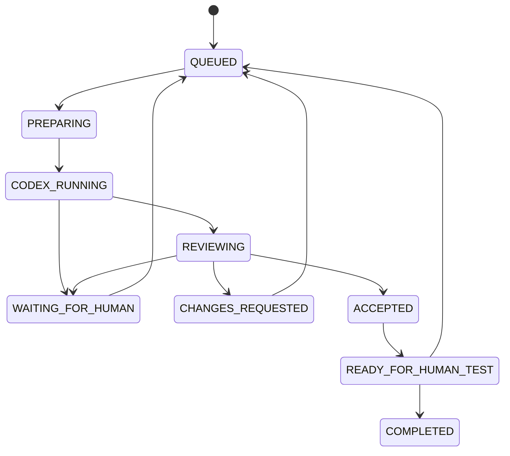

# Architecture de codexbridge

Le package TypeScript unique évite les dépendances circulaires d’un monorepo prématuré. Les modules ont des interfaces explicites : domaine, SQLite, Git, adapter Codex, reviewer, orchestrateur, outils MCP, serveur HTTP, CLI et dashboard sans framework.

## Flux et état

`create_job` valide le schéma et canonicalise le dépôt. Une transaction crée un identifiant `CB-n`, les données du job et son premier événement. Une clé d’idempotence optionnelle évite les créations doubles. Le scheduler local dépile un job ; ChatGPT n’a pas à rester connecté.

Les états actifs peuvent échouer ou être annulés. Le graphe exact est dans `src/domain.ts`. Un budget épuisé produit `FAILED`, pas une décision produit fictive. Retry peut ajouter cinq passages, avec événement humain enregistré. `ACCEPTED` et `READY_FOR_HUMAN_TEST` sont deux transitions journalisées distinctes, généralement immédiates ; seul l’utilisateur confirme `COMPLETED`.

## CodexAdapter

`run(RunOptions)` reçoit workspace, thread existant, schéma de sortie, signal d’annulation et callbacks. `AppServerAdapter` lance le binaire directement, sans shell ; utilise JSON-RPC par stdio, initialise, démarre/reprend un thread puis un turn avec `outputSchema`. L’identifiant du thread est persisté **avant** le turn. Les passages suivants reprennent ce thread.

Les notifications de messages, commandes, sorties et modifications deviennent des événements SQLite. Les erreurs de transport, JSON invalide, délais et exit du processus sont isolés au job. Le résultat final est validé par Zod. Les demandes d’élévation sont refusées et exposées avec leur contexte ; jamais d’acceptation implicite. L’annulation envoie `turn/interrupt`, ferme stdio puis termine le groupe de processus si nécessaire.

Le protocole a été examiné à partir des bindings générés par le CLI présent via `codex app-server generate-ts`. L’adapter est volontairement isolé car ce protocole évolue.

## Reviewer

Le reviewer est distinct : soit un nouveau thread Codex en lecture seule, soit un appel Responses API sans outil d’écriture. Il reçoit ticket, critères, résultat, diff et reviews précédentes. Son JSON est validé. `REQUEST_CHANGES` retourne au thread worker original ; `HUMAN_REQUIRED` produit un blocage précis. Une acceptation est refusée si les tests sont déclarés en échec, absents ou si le diff est tronqué.

Les tests du projet cible sont exécutés par Codex dans sa sandbox et rapportés avec leurs commandes. Le reviewer peut vérifier les preuves mais le serveur ne transforme pas du texte de ticket en commande shell. Le test E2E de la fixture réexécute indépendamment `node --test`.

## SQLite et recovery

Node 24 fournit `node:sqlite`, sans module natif à compiler. WAL, foreign keys, busy timeout et `PRAGMA user_version` accompagnent une migration transactionnelle. Tables : jobs, job_events, codex_threads, reviews, human_decisions, repository_locks, settings. Les transitions et leur événement sont atomiques. L’historique est append-only ; pas de suppression automatique.

Le verrou de service empêche deux schedulers d’utiliser la même configuration ; les locks SQLite empêchent deux jobs d’un dépôt de préparer des worktrees simultanément. La V1 exécute globalement un job à la fois. Les références de branche/worktree/base sont persistées avant la création Git, permettant une inspection après crash.

Après arrêt brutal, les passages actifs deviennent `FAILED` avec l’ancien état, le thread et une inspection Git. Aucune opération interrompue n’est réputée réussie. Un PID Codex encore vivant bloque retry. Une reprise explicite conserve les changements et demande au worker de vérifier ce qui est déjà fait. Les reviews acceptées et les corrections en attente sont récupérées sans perdre leurs transitions. Voir le [scénario recovery](docs/RECOVERY.md).

## MCP, HTTP et notifications

Les onze outils sont définis une seule fois dans `src/tools.ts`, avec input strict, output structuré et annotations. MCP utilise le SDK officiel et Streamable HTTP stateless : une reconnexion client ne touche pas le scheduler. Le proxy stdio permet l’usage local et Secure MCP Tunnel. HTTP et CLI utilisent les mêmes opérations.

Le journal est la couche de notification durable. Le dashboard consomme SSE avec curseur ; MCP récupère les événements et rapports. `Store` expose également un EventEmitter indépendant du transport pour brancher un futur sink. Aucun webhook ni message externe n’est émis par défaut.

## Git et sécurité

Chaque job utilise `codexbridge/CB-n`, un worktree sous le dossier de données et le commit de base capturé. Le diff englobe changements commités, index, modifications locales et fichiers non suivis ; la troncature est explicite. Aucun merge ni push n’est implémenté par le service. Les chemins sont canonicalisés et l’appartenance du worktree au dépôt est vérifiée avant inspection. Voir [SECURITY.md](SECURITY.md) pour les limites de confiance.
